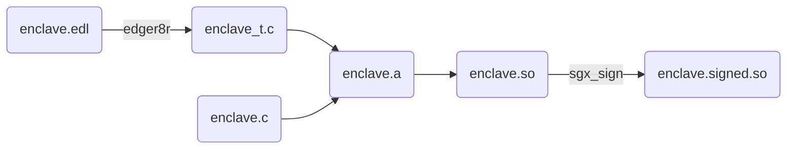
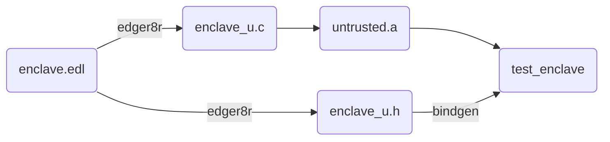

# Test Enclave (and interface) for testing enclave creation

Provides a simple enclave that can be used to exercise the SGX SDK for creating
an enclave and for calling into functions in the enclave.

This crate supports testing with the simulation as well as the hardware SGX
SDKs. In order to test with the hardware SDKs use the `hw` feature.

This crate can be added to the development dependency of the crate to test the
creation of enclaves with.

```toml
[dev-dependencies]
test_enclave = { path = "some/path/to/this/crate" }
```

Note: In order to disambiguate, the term *build* will be used to describe the
process of building different enclave artifacts. The term *create* will be
reserved for refering to SGX SDK's use of create ala `sgx_create_enclave()`.

## Table of Contents

- [Build Customizations](#build-customizations)
- [Build Details](#build-details)

## Build Customizations

There are a number of environment variables that can affect the building of the
test enclave and associated artifacts:

| Variable             | Type     | Actions                                                                                                                                      |
|----------------------|----------|----------------------------------------------------------------------------------------------------------------------------------------------|
| `SGX_SDK`            | `dir`    | The path to the SGX SDK. When unset will default to `/opt/intel/sgxsdk`.                                                                     |
| `OUT_DIR`            | `dir`    | The directory to place the built artifacts.  This is normally set by Cargo.                                                                  |
| `CARGO_MANIFEST_DIR` | `dir`    | The directory to refere to the root of this crate.  Used to locate some build time inputs.                                                   |
| `LD`                 | `binary` | The path to the linker to use.  Enclaves can not be built reliably with `lld` so this must be an `ld` flavor.  When not set defaults to `ld`.|

## Build Details

Quite a bit happens during the build process, this section tries to capture
that.

There are two main outputs:

1. The signed enclave for use in `sgx_create_enclave()`.  
2. Bindings to the SGX interface for the untrusted code, so that tests can call
   into the enclave.

### Enclave Binary

Building the signed enclave binary is a multistep process:

1. `enclave.edl` is processed by the `edger8r` tool to generate `enclave_t.c`.
2. `enclave.c` and `enclave_t.c` are built into a static library `enclave.a`.
3. `enclave.a` is linked into a shared library `enclave.so`. This links in the
   Intel SGX SDK libraries.
4. `enclave.so` is signed with the `sgx_sign` utility
   generating `enclave.signed.so`. This is the final binary used for creating an
   enclave with `sgx_create_enclave()`.



### Untrusted Bindings

The untrusted bindings

1. `enclave.edl` is processed by the `edger8r` tool to generate `enclave_u.c`
   and `enclave_u.h`.
2. `enclave_u.c` is built into a static library `untrusted.a`. This will be
   linked into the resultant `test_enclave` crate.
3. `enclave_u.h` is used to generate rust bundings to `untrusted.a`. This will
   be the majority of the `test_enclave` crate.


